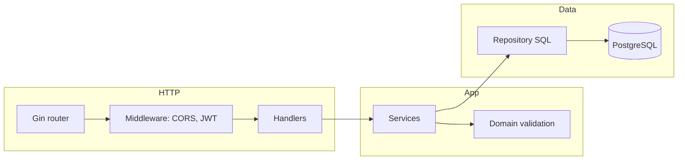
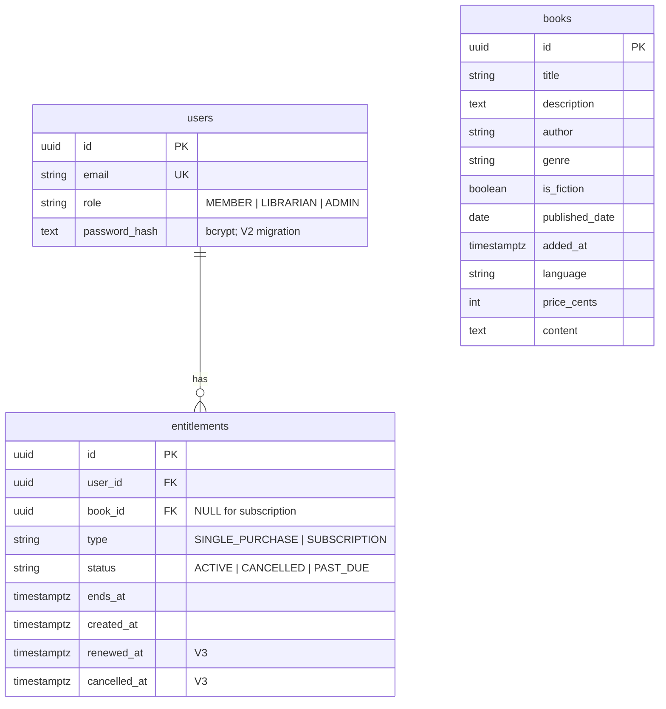

# Mainstory Digital Library (take-home backend)

HTTP API for a **paid digital storybook library** MVP: **subscription** (all books while active) and **one-time purchases** (per book). This repository is a **Go** service using **Gin**, **PostgreSQL**, and **JWT bearer authentication**.

---

## What this project is

A small **JSON REST API** (`/api/v1/...`) that backs catalog browsing, member library access, mock purchases/subscriptions, and **role-based** staff tools (**MEMBER**, **LIBRARIAN**, **ADMIN**). The server evaluates **entitlements** (subscription or purchase) when deciding whether book **content** is visible and how list/detail **`access_reason`** fields are set.

**Authoritative browser integration** (paths, bodies, status codes, auth, errors, CORS expectations) lives in **[docs/api-contract.md](docs/api-contract.md)**.

**Agent-oriented repo map and change log** live in **[AGENTS.md](AGENTS.md)**. Deeper product and prompt history notes are in **[docs/submission.md](docs/submission.md)**.

---

## Feature set (product)

| Area | Behavior |
|------|----------|
| **Auth** | Register and login return a **Bearer JWT**; protected routes derive **user id** and **role** from the token, not from client-supplied ids. |
| **Catalog** | Paginated, filterable **book list** without full **content** in list SQL; **optional JWT** on catalog routes so guests can browse metadata while signed-in users get correct **access** flags. |
| **Recent titles** | **Top five** books by catalog **`added_at`** for home-page style surfaces; same list shape as the main catalog. |
| **Book detail** | Metadata for all; full **content** only when the caller is **entitled** (active subscription or purchase for that book), or **staff** preview rules apply. |
| **Access UX** | List and detail expose **per-book** accessibility hints (e.g. locked vs subscription vs purchased) so a SPA can render paywalls consistently. |
| **Purchases** | **Single-book** entitlements are **idempotent** at the data layer (at most one purchase row per user+book). |
| **Subscriptions** | **All-books** subscription model (`book_id` null on subscription rows); **cancel at period end** keeps access until **`ends_at`**; renewal/cancel timestamps support the billing window. |
| **Member library** | Aggregated “my library” payload (subscription + purchased books, metadata) for account pages. |
| **Self-service** | Password change for the signed-in user; members can **cancel renewal** for the current subscription period. |
| **Staff** | **Librarian**/**Admin**: curated book writes (delete is **admin-only**); **filtered** user directory and **filtered** global entitlement browse; **Admin** can patch entitlements and manage users per contract. |

There is **no** public API to grant **ADMIN** or **LIBRARIAN**; those roles are expected to exist only via **database operations** your operators control.

---

## Architecture (code)

Layers are kept **thin at the HTTP edge** and **testable in the middle**:

- **`internal/handlers`** — parse/validate HTTP, map domain errors to status codes, JSON envelopes.
- **`internal/service`** — subscriptions, purchases, catalog access evaluation, user operations.
- **`internal/repository`** — SQL and row mapping behind small store interfaces (swapped for **fakes** in tests).
- **`internal/domain`** — shared validation and types (roles, filters, entitlement invariants).
- **`internal/middleware`** — Bearer auth, optional Bearer for catalog, CORS, role guards.
- **`internal/config`** — process configuration loading (required connectivity and crypto material, optional tuning); **this README intentionally does not list environment variable names**—see source when wiring a deployment.



**Migrations** are versioned SQL under **`db/migration/`** (Flyway-style names). Apply them with your organization’s migration process against the same Postgres instance the app uses.

---

## Data model (schema)

Conceptual **entity-relationship** view (constraints and partial unique indexes are simplified in the diagram; see SQL for exact definitions):

**Relationships:** every entitlement belongs to one **user**. **`book_id`** references **books** only for **single purchase** rows; **subscription** rows keep **`book_id`** null (all-books access).



**Notable invariants (MVP)**

- **Purchase** rows require **`book_id`**; **subscription** rows require **`book_id`** to be **null** (all-books access).
- **At most one** active **subscription** row per user (partial unique index).
- **At most one** **purchase** row per **(user, book)** (partial unique index) so retries do not duplicate ownership.

---

## Testing

| Concern | Approach |
|---------|----------|
| **Unit / service tests** | Table-driven tests under **`internal/domain`** and **`internal/service`** with **in-memory fakes** for repositories—**no Docker** and **no live Postgres** required. |
| **Scope** | Access rules, subscription windows, catalog list shaping, staff list filters, and related edge cases are covered in Go tests. |
| **Packages without `_test.go`** | Handlers and repositories rely on service-level tests and fakes rather than spinning up a real database in CI. |

**Local**

```bash
go test ./...
```

**Continuous integration**

On pull requests targeting **`main`**, GitHub Actions runs **`go build ./...`** then **`go test ./...`** on **ubuntu-latest** using the **Go version from `go.mod`**.

---

## Build

```bash
go build -o app .
```

The binary serves HTTP on the port supplied by your runtime configuration (see **`internal/config`**).

---

## Health

```http
GET /healthcheck
```

Returns **`UP`** when the process is running (this endpoint does not exercise the database).

---

## Documentation map

| Document | Audience | Contents |
|----------|----------|----------|
| **[docs/api-contract.md](docs/api-contract.md)** | Frontend / SPA | Endpoints, JSON, auth, errors—**safe to share** with integrators. |
| **[AGENTS.md](AGENTS.md)** | Contributors + AI agents | Repo map, product rules, append-only change log. |
| **[docs/submission.md](docs/submission.md)** | Reviewers | Product/system notes and prompt-by-commit history. |
| **`db/migration/*.sql`** | Backend + DBAs | Canonical schema and constraints. |

---

## Security note for operators

This README avoids listing **environment variable names**, **connection string patterns**, **secret generation commands**, and **copy-paste migration credentials**. Treat deployment wiring, secrets, and database access as **operator documentation** stored alongside your infrastructure—not in this public overview.
